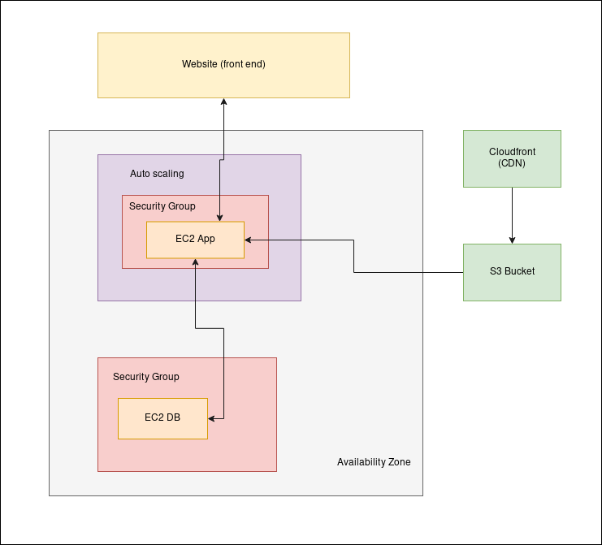
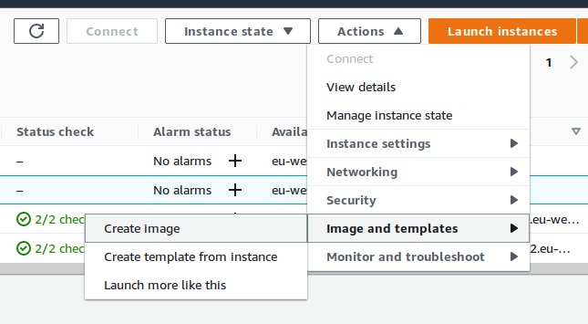
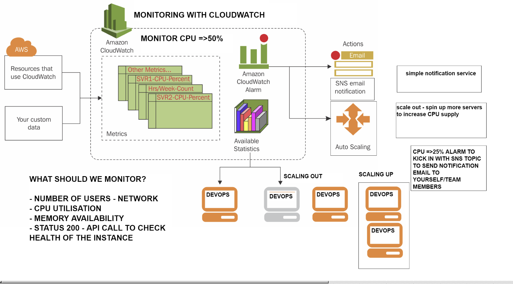
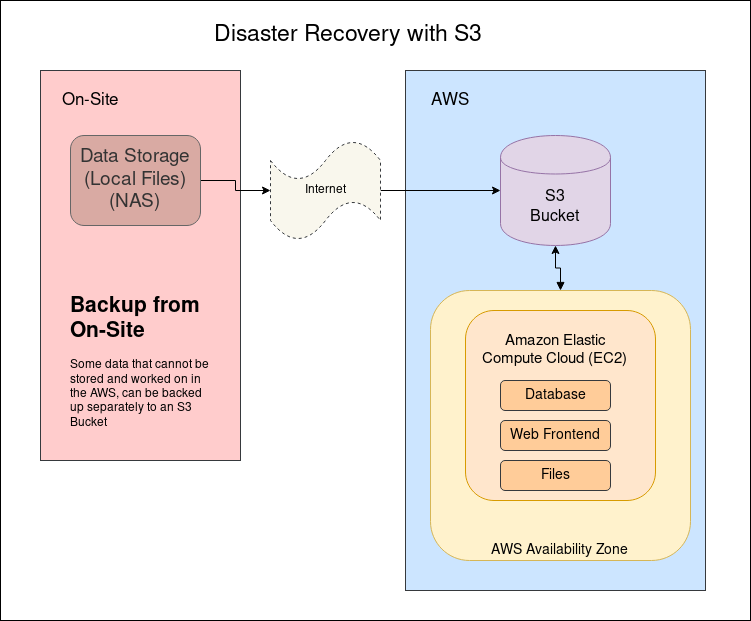
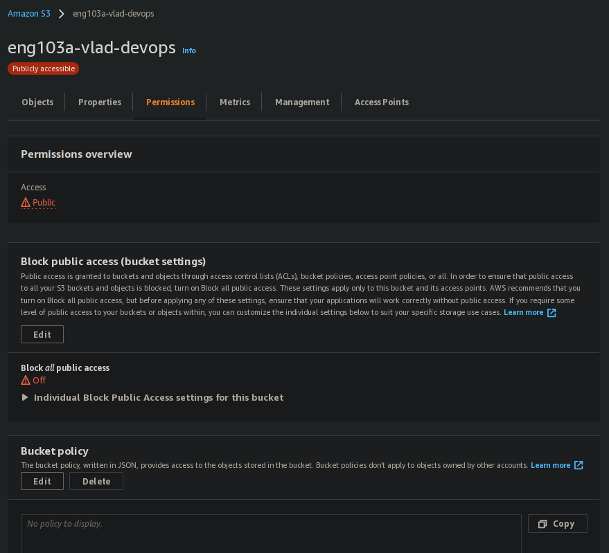
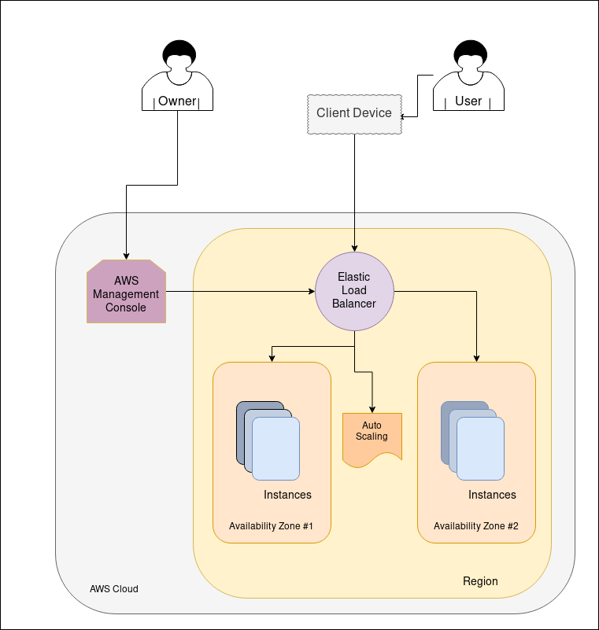
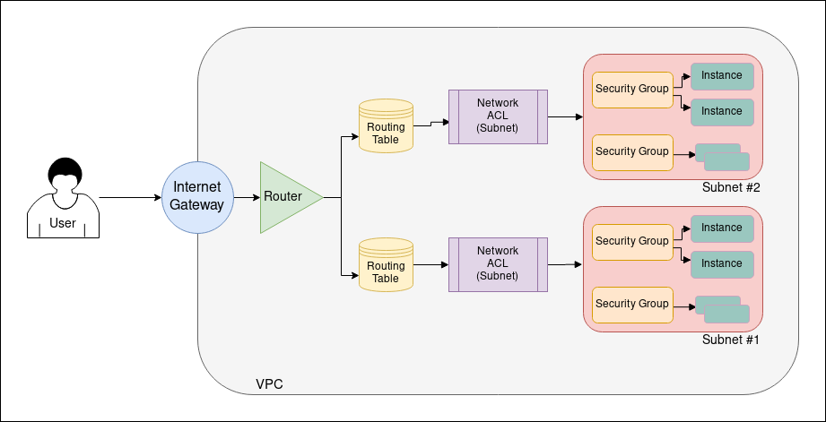

# Index

## 1. Intro
[Benefits of DevOps](#benefits-of-devops)  
[Monolith and 2 tier](#monolith-and-2-tier)  
[Installing Vagrant](#installing-vagrant)  
### 1.1 Linux
[Linux basics](#linux-basics)  
[Permissions](#permissions)  
[Bash Scripting](#bash-scripting)  
  
## 2. Vagrant
[PreRequisites to run the app task](#prerequisites-to-run-the-app)  
[Automation](#automation)  
### 2.1 More on Linux
[Linux Variables](#linux-variables)  
[Environment Variables](#environment-variables) 
### 2.2 Running Node App
[Example of the App checking an env variable](#example-of-the-app-checking-an-env-variable)  
[Running the App](#running-the-app)  
[Adding full automation with a crontab](#adding-full-automation-with-a-crontab) 
### 2.3 Proxy 
[Reverse Proxy](#reverse-proxy)  
[Forwarding a Port](#forwarding-a-port)  
### 2.4 Vagrant VMs
[Two and more VMs](#two-and-more-vms) 
### 2.5 MongoDB 
[MongoDB in the DB VM](#mongodb-in-the-db-vm)  
[Installing specific version for this app](#installing-specific-version-for-this-app)  
[MongoDB Install](#mongodb-install)  
[Enable access for app VM](#enable-access-for-app-vm)  
  
## 3. AWS
[AWS and Cloud Computing](#aws-and-cloud-computing)  
[Regions](#regions)  
[Pre Deployment](#pre-deployment)  

## 4. AWS - EC2
[Steps to Launching our demo app](#steps-to-launching-our-demo-app)  
[Launching it in real life](#launching-it-irl)  
[Steps on local machine](#steps-on-local-machine)  
[Alternative file transfer from Local Machine](#alternative-file-transfer-from-local-machine)  
[AMI (Amazon Machine Image)](#amazon-machine-image)  
[Creating an image](#creating-an-image)  
  
## 5. AWS - Cloudwatch
[Monitoring with CloudWatch](#monitoring-with-cloudwatch)  
[Simple Notification Service](#simple-notification-service)  
[Autoscaling](#autoscaling)  
[Notifications](#notifications)  
  
## 6. AWS - S3 Storage
[What is S3](#what-is-s3)  
[Advantages of S3](#advantages-of-s3)  
[Use Cases for S3](#use-cases-for-s3)  
[S3 Storage Classes](#s3-storage-classes)  
### 6.1 Crud
[What is Crud](#what-is-crud) 
### 6.2 Using S3
[Connecting EC2 to S3](#connecting-ec2-to-s3)  
[Creating a Bucket, and other commands](#creating-a-bucket)  
[S3 Permissions](#s3-permissions)  
[Using the Bucket](#using-the-bucket)  
[Removing the Bucket and files](#removing-the-bucket-and-files)  
  
## 7. AWS - Auto Scaling  
[What is auto scaling](#auto-scaling)  
[Templates](#templates)  
[Auto scaling group](#auto-scaling-group)  
  
## 8. AWS - Virtual Private Cloud  
[What is a Private Cloud](#aws-virtual-private-cloud)  
### 8.1 The Structure  
[CIDR block](#what-is-cidr-block)  
[Internet Gateway](#what-is-internet-gateway)  
[Route Table](#what-is-a-route-table)  
[Subnet](#what-is-subnet)  
[Security Groups](#what-are-security-groups)  
[NACL](#what-is-nacl)  
### 8.2 Creating an AWS Virtual Private Network  
[Steps](#creating-an-aws-virtual-private-network)  
  
</br></br></br>

# What is DevOps
## Why DevOps

### Benefits of DevOps

**Four pillars of DevOps best practice**  
- Ease of Use (Human interaction)  
- Flexibility (When client wants more features at the end of a sprint,, we are flexible to add these)  
- Robustness - Faster delivery of product  
- Cost - Cost Effective (minimising cost by automating, CI/CD etc..)  

<br><br>


### Monolith and 2 tier
Monolith  
(One box that has the front end, back end, database)  
(Everytime you add a feature, you have to restart the entire program)  
(Uptime, responce time, etc..)  

2 tier  
(breaking it down into smaller things with AWS)

Microservices  
(Separating it into even smaller things for improved uptime, and easier updating)


## Installing Vagrant

Download [Normal installers for] Vagrant, VirtualBox, Ruby one-click installer, install them  
Make a folder for Vagrant. Inside of the folder make a "vagrantfile" file, without extensions.  
Inside of it, add:  
  
```
$script = <<-'SCRIPT'
apt-get update -y
apt-get upgrade -y
apt-get install -y nginx
SCRIPT

Vagrant.configure("2") do |config|
 config.vm.box = "ubuntu/xenial64"
# creating a virtual machine ubuntu 
 config.vm.network "private_network", ip: "192.168.56.4"
 config.vm.synced_folder "src/", "/home/vagrant/code"
 config.vm.provision "shell", inline: $script
 config.vm.provision "shell", path: "src/init.sh"
end
```

Then, launch gitbash in the same folder as "vagrantfile"
And do `vagrant up` command to start downloading Ubuntu.  
  
This will install virtualbox, set up a local ip you can reach with your browser for nginx,  
and then run the script which updates the vm and installs nginx  
  
Once its up, do `vagrant ssh`, and use logout to leave VM  
`vagrant halt` stops the vm.  

### Linux basics

- Name of the machine and details `uname -a`
- Working directory `pwd`
- Show all files `ls -a`
- Create a directory `mkdir`
- Change directory `cd`
- Make a file `touch <file>` or `nano <file>`
- Print file `cat <file>`
- Remove file `rm <file>`
- Recursively remove a directory `rm -rf <directory>`
- Copying a file `cp <origin-file&location> <final-file or location>`
- Moving or renaming `mv <origin-file&location> <final file (and or name)>`
- List active processes `top`
- Running services `ps aux`
- Killing a process by id (from ps aux) `kill <id>`

#### Permissions

- View file permissions in a folder `ll`
- Changing permission `chmod <permissions> <file>`

#### Bash Scripting

- Run bash scripts `./<script>` or `sh <script>`
- Start scripts with `#!/bin/bash`


### PreRequisites to run the app task

Install ruby test dependencies in local/host machine `gem install bundler`
Then `bundler` and `rake spec`

### Automation

Script to automate installation of app requirement 

```
#!/bin/bash
sudo apt-get update -y
sudo apt-get upgrade -y
sudo apt-get install nginx -y
sudo apt-get install python-software-properties

curl -sL https://deb.nodesource.com/setup_6.x | sudo -E bash -
sudo apt-get install nodejs -y
sudo npm install pm2 -g

#install forever and app
cd /home/vagrant/code/app
sudo npm install forever -g
npm install

#set up port forwarding
sudo cp /home/vagrant/code/default /etc/nginx/sites-available/
sudo systemctl restart nginx

#start the app for the first time
forever start app.js

#make it start automatically when you boot after first setup
(crontab -l 2>/dev/null; echo "@reboot sleep 10 && sh /home/vagrant/code/app/startForever.sh") | crontab -

```

### Linux Variables
- Creating a variable in Linux `FIRST_NAME=BOB` (should be in caps to stand out, like $PATH)
- Checking the variable `echo $FIRST_NAME`

### Environment Variables
- Checking Env variables `env`,  
- Checking specific variables `printenv <specific variable>` like `printenv HOME` 

#### Example of the App checking an env variable

```
if(process.env.DB_HOST) {
  mongoose.connect(process.env.DB_HOST);

  app.get("/posts" , function(req,res){
      Post.find({} , function(err, posts){
        if(err) return res.send(err);
        res.render("posts/index" , {posts:posts});
      })
  });
}
```

- Saving an environment variable `export VAR_NAME=TEST`
- Permanantly saving a variable `nano ~/.bashrc` and add the variable at the end `export VAR_NAME=TEST`
- Removing a variable `unset VAR_NAME`

### Running the App
- Starting `npm start`  
- Or with Forever - install first with `sudo npm install forever -g` and run with `forever start app.js`  
  

#### Adding full automation with a crontab

- Installing a crontab  
`(crontab -l 2>/dev/null; echo "@reboot sleep 10 && sh /home/vagrant/code/app/startForever.sh") | crontab -`  
  
- The script used above: 

```
#!/bin/bash
cd /home/vagrant/code/app/
forever start app.js
echo "STARTED FOREVER"
```


### Reverse Proxy

- Forwarding a port to a different port, like 80 to 3000

#### Forwarding a Port

- Make changes to /etc/nginx/sites-available/default

```
server {
	listen 80 default_server;
	listen [::]:80 default_server;
	root /var/www/html;

	server_name _;

    location / {
            proxy_pass http://localhost:3000/;
            proxy_http_version 1.1;
            proxy_set_header Upgrade $http_upgrade;
            proxy_set_header Connection 'upgrade';
            proxy_set_header Host $host;
            proxy_cache_bypass $http_upgrade;
    }
}
```

- After which you need to restart nginx: `sudo systemctl restart nginx`


### Two and more VMs

- Saved in separate do statements in the Vagrantfile:

```
Vagrant.configure("2") do |config|
 config.vm.define "app" do |app|
  app.vm.box = "ubuntu/xenial64"
#  creating a virtual machine ubuntu 
#  config.vm.network "forwarded_port", guest: 80, host: 8080, id: "nginx"
  app.vm.network "private_network", ip: "192.168.56.4"
  app.vm.synced_folder "src/", "/home/vagrant/code"
#  config.vm.provision "shell", inline: $script
  app.vm.provision "shell", path: "src/init.sh"
 end

 config.vm.define "db" do |db|
  db.vm.box = "ubuntu/xenial64"
  db.vm.network "private_network", ip: "192.168.56.5"
 end

end

```


### MongoDB in the DB VM

<br><br>


#### Installing specific version for this app  

Add a key first:  
```
sudo apt-key adv --keyserver hkp://keyserver.ubuntu.com:80 --recv D68FA50FEA312927
```

#### MongoDB Install:  
```
echo "deb https://repo.mongodb.org/apt/ubuntu xenial/mongodb-org/3.2 multiverse" | sudo tee /etc/apt/sources.list.d/mongodb-org-3.2.list

sudo apt-get update -y
sudo apt-get upgrade -y

sudo apt-get install -y mongodb-org=3.2.20 mongodb-org-server=3.2.20 mongodb-org-shell=3.2.20 mongodb-org-mongos=3.2.20 mongodb-org-tools=3.2.20

sudo systemctl enable mongod
sudo systemctl start mongod
sudo systemctl status mongod
```

#### Enable access for app VM:
```
cd /etc
sudo nano mongod.conf
```
- Change under #network interfaces `bindIp: 127.0.0.1`  to `bindIp: 0.0.0.0` or `bindIp: 192.168.56.4` (the app VM IP)

Then restart again
```
sudo systemctl restart mongod
```

Then switch VMs to app, and create a permanent env variable `DB_HOST`

- In bashrc, `nano ~/.bashrc`, add `export DB_HOST='mongodb://192.168.56.5:27017/posts'`
- REFRESH systems cache for bashrc with `source ~/.bashrc`
- Check it with `printenv DB_HOST`


node seeds/seed.js

## AWS and Cloud Computing
### Basics
#### Regions
- We are using Europe
- At least 2 servers (availability zones) in each location

#### Pre Deployment 
- Who are we deplying for? Choose location based on that.

## EC2
Elastic Compute Service  



#### Steps to Launching our demo app
- We might need Linux Ubuntu 16.04-18.04
- Migrate app data
- Expose needed ports


#### Launching it irl
- Switch location in top right first
- Search "EC2"
- Launch Instance (orange button)
Step1:  
- Search for Ubuntu
- Pick `Ubuntu Server 18.04 LTS (HVM), SSD Volume Type`  
Step2:  
- Leave defaults `t2.micro`  
Step3:  
- Subnet `devops 1a`
- (opt) add User Data `cd ~/app && npm start`
Step4: no changes  
Step5:
- Add new key  
- Key: `NAME`
- Value: `ENG103_VLAD`
Step6 (firewall):  
- Create new security group
- Sec group name: `eng103a_vlad`
- Desc: `eng103a_shahrukh`
- SHH; TCP; 22; My IP; "My IP Only"
Review&Launch  
  
Private Key goes to `~/.shh`
- Chose `Choose an existing key pair` right before launching
- `Select a key pair` should be `eng103a RSA` 

- On the instance, click  on the security group >  edit inbound rules > HTTP & any ipv4

#### Steps on local machine
Private Key goes to `~/.shh`
- `chmod 400 eng103a.pem` to make key only readable only to owner
- `ssh -i "<path to your access key>.pem" ubuntu@ec2-3-251-89-188.eu-west-1.compute.amazonaws.com` to connect to the machine, found in the instance list > start

- Once connected to the SSH, install subversion `sudo apt-get install subversion`
- With subversion go to your github folder that you want to clone (instead of the whole project) and replace `tree/main` with `trunk`. Now you can copy that and run `svn checkout https://github.com/dankxylese/DevOps-linux/trunk/Vagrant/src`. This will clone just this folder.
- Then find your init.sh script that you used for Vagrant, adjust it a little (especially with directories), and run, which will install everything automatically.
- Restart nginx. In `~/code/app` do `npm start`.  
- Go to ip (http://54.247.20.44/) or (http://54.247.20.44:3000/) cause we opened ports by now, installed nginx and ran the app.

#### Alternative file transfer from Local Machine

- Get local files and copy them to AWS `scp -i <path to your access key>.pem -r <origin> ubuntu@ec2-3-250-15-190.eu-west-1.compute.amazonaws.com:~`

### Amazon Machine Image
- Like a snapshot in VirtualBox.
- Can share machine states with others.
- Helps automate deployment.

#### Creating an image



- In the top right make an image
- Then in AMIs on the left hand side find your image, where you can launch an instance of it

## CloudWatch

### Monitoring with CloudWatch
- Monitors System status and resources

#### Simple Notification Service
- Sends an email or text message to notify of status 

#### Autoscaling
- Scaling out is adding more computers / CPUs to deal with the load (autoscaler, spinning up more VMs to handle the load).
- Scaling up is increasing the minimum requirement by improving hardware in the beginning. (Going from T2.micro to T2.medium)

### Alert Management
- Who is going to take management and what will happen to the instance after the (email) notification has been sent.

## S3 Storage
### What is S3
Amazon Simple Storage Service (Amazon S3) is an object storage service that offers industry-leading scalability, data availability, security, and performance. Customers of all sizes and industries can use Amazon S3 to store and protect any amount of data.

#### Advantages of S3
- Globally available.
- Reliable Security.
- Low cost.
- Ease of Migration.
- Simplicity of Management.

#### Use Cases for S3
- Used for Disaster Recovery.
- We can perform the CRUD operations (Create, Read, Update, Delete).
- Analytics.
- Data Archiving.
- Static Website Hosting.
- Security and Compliance.

#### S3 Storage Tiers
- Standard: Access data any time (When data is needed frequently).
- Glacier: infrequent data access (Cheap, but much slower and has limits on how many times you access it a week/month)
- [More Tiers](https://docs.aws.amazon.com/AmazonS3/latest/userguide/storage-class-intro.html)
  
  

  
### Connecting EC2 to S3
- S3 identifies the EC2 via AWS Access Key and Secret Key (*.pam*) through AWS-CLI configuration.
- For AWS-CLI you need `Python3`, `pip3` (within your AWS instance / VM)
  - `sudo apt install python3 -y && sudo apt install python3-pip -y`
  - and add alias `alias python=python3` for easier use or alternatively don't forget to use `python3` in front of each command to avoid the system calling python2 if that is installed
  - `sudo pip3 install awscli`
  - `aws configure` with `eu-west-1` as region (for Ireland) and `json` for the preferred language
  - test your connection by listing available buckets with `aws s3 ls`
  
### What is Crud
- Crud is originally used as a software solution to access data within the relational database. But data in S3 is not relational, and thus Crud there has *richer* abstractions
- We can create (Bucket/Object), read, update, delete. We can see the uses below

### Using the Bucket
#### Creating a Bucket
- `aws s3 mb s3://<your bucket>` (The name has restrictions. You can't have `_` for example)

#### Moving files to our Bucket
- `aws s3 cp <filename> s3://<your bucket>`

#### Viewing data in your bucket
- `aws s3 ls s3://<your bucket>`

#### Removing the Bucket and files
- `aws s3 rm s3://<your bucket> --recursive` - Remove all files from Bucket
- `aws s3 rb s3://<your bucket>` - Remove Bucket (remove all of the files first)

### Using the Bucket with Boto3
- First of all, install it on the AWS Instance `pip3 install boto3`


### S3 Permissions
- Permissions are important, they can be edited here



### Working on the Bucket with Boto3
- Check out this file. It all works.


## Auto scaling

Auto Scaling monitors your applications and automatically adjusts capacity to maintain steady, predictable performance at the lowest possible cost.

Auto Scaling uses multiple components, I've written about in detail above, to achieve its goal:
  - AMI (Amazon Machine Image)
  - Load Balancer
  - Snapshot
  - EC2 Instance
  - Autoscaling groups




#### Templates
- Create a template by selecting `Launch Templates` from the side bar.
- Tick `Auto Scaling guidance`
- In Advance, add User data - commands that will run in console on start

#### Auto scaling group
- VPC (-6da)
- In the network section, select your availability zones (-9d2; -164; -0e5)
- And Enable group metrics
- Group size (2,2,3)
- Tick `Target tracking scaling policy`


## AWS Virtual Private Cloud
Virtual Private Cloud lets you work in a private section of the Cloud, where cloud services that you launch are isolated from other users and resources. You have complete control over your virtual networking environment, including selection of an IP address range, creation of subnets, and configuration of route tables and network gateways.



### The Structure
#### What is CIDR block
- Classless Inter-Domain Routing, is a method for allocating IP addresses and for IP routing

#### What is Internet Gateway
- A gateway which connects public subnet to public internet. It sits between the internet and your applications, converting information your application receives and sends from one protocol to another.

#### What is a Route Table
- The routing table contains a list of specific routing destinations. When the router receives a packet of data, it references the routing table to know where to send that data.

#### What is Subnet
- Subnet is a range of IP addresses in your VPC. You can launch AWS resources, such as EC2 instances, into a specific subnet
  - Public Subnet : Accessible via Internet. Uses a Internet Gateway to reach Internet.
  - Private Subnet : Non accessible via internet. Can use a NAT Gateway, which would provide a one way connection from your private subnet to external resources (resource not in your VPC)

#### What are Security Groups
- Security Groups are a virtual firewall on a per instance basis. This Helps filter network traffic to instances within a VPC (like EC2, Database)


#### What is NACL
- NACL is similar to Security Groups as it acts like a firewall for subnets instead of separate instances.


### Who do we create an AWS Virtual Private Network
My Subnet/CIDR block `10.0.10.0/24`

Step 1  
- Select Region - Ireland  
- Create VPC  
- Valid CDIR block for out VPC (10.0.0.0/16)  
  
Step 2  
- Create Internet Gateway (IG)  
- Attach IG to our VPC  
  
Step 3  
- Create Public Subnet  
- Associate the Subnet to our VPC  
  
Step 4  
- Create Route Table(s) for our Public Subnet (empty by default)  
- Edit routes to allow IG (add routes)  
- Associate to our Public Subnet  
  
Step 5  
- Create Security Group in our Public Subnet, to allow required ports  
- Allow port 80, 3000 (for our app)  
  

### Creating an AWS Virtual Private Network
#### VPC
- Search `VPC` > `Your VPCs` > `Create VPC`  
- Name is `eng103a_vlad_vpc` and IP is `10.0.0.0/16`  

#### Internet Gateway
- Then from the sidebar `Internet gateways` > `Create Internet gateway`  
- Name is `eng103a_vlad_ig`  
- Then on the IG, (top right) click `Actions` > `Attach VPC`
- State should change to `Attached`

#### Subnet
- Then from the sidebar `Subnets` > `Create subnet`
- Select the VPC
- Name is `eng103a_vlad_public_subnet`
- IPV4 CIDR block is `10.0.10.0/24`

#### Route Table
- Then from the sidebar `Route Tables` > `Create route table`
- Select the VPC
- Name is `eng103a_vlad_rt_public`
- Then on the RT, (top right) click `Actions` > `Edit routes`
- `Add route` > Destination `0.0.0.0/0` (everyone) > Target - click on `Internet Gateway` it should show you options starting with `igw-` that you've made.
- Then on the RT, (top right) click `Actions` > `Edit subnet associations`
- Select the correct subnet you want to enable internet connectivity for. We only have 1 right now.


Now when you're creating an EC2 instance, you can select your own VPC, and your subnet. The public one should have the app, and you should also make a separate subnet for the DB, and then link them later.

### Connect the DB instance now
- Make a new subnet
- Leave routing tables unchanged (the only route should be 10.0.0.0/16 with local target) 
- Make sure to not assign a public ip for it when creating the instance