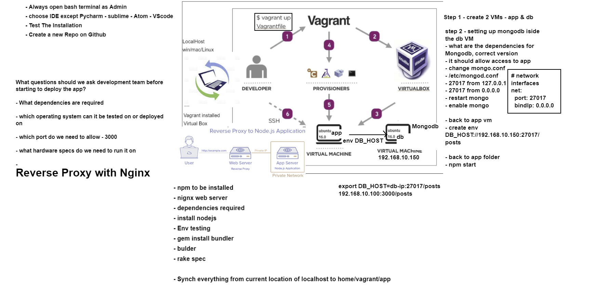
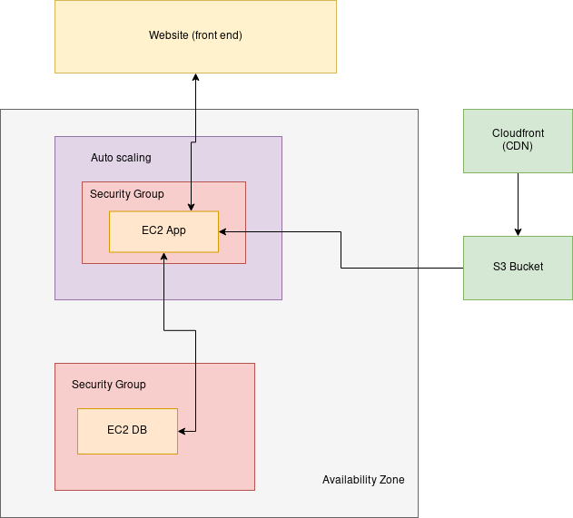

# What is DevOps
## Why DevOps

### Benefits of DevOps

**Four pillars of DevOps best practice**  
- Ease of Use (Human interaction)  
- Flexibility (When client wants more features at the end of a sprint,, we are flexible to add these)  
- Robustness - Faster delivery of product  
- Cost - Cost Effective (minimising cost by automating, CI/CD etc..)  

<br><br>


### Monolith, 2 tier and Microservices Architectures
Monolith  
(One box that has the front end, back end, database)  
(Everytime you add a feature, you have to restart the entire program)  
(Uptime, responce time, etc..)  

2 tier  
(breaking it down into smaller things with AWS)

Microservices  
(Separating it into even smaller things for improved uptime, and easier updating)


## Installing Vagrant

Download [Normal installers for] Vagrant, VirtualBox, Ruby one-click installer, install them  
Make a folder for Vagrant. Inside of the folder make a "vagrantfile" file, without extensions.  
Inside of it, add:  
  
```
$script = <<-'SCRIPT'
apt-get update -y
apt-get upgrade -y
apt-get install -y nginx
SCRIPT

Vagrant.configure("2") do |config|
 config.vm.box = "ubuntu/xenial64"
# creating a virtual machine ubuntu 
 config.vm.network "private_network", ip: "192.168.56.4"
 config.vm.synced_folder "src/", "/home/vagrant/code"
 config.vm.provision "shell", inline: $script
 config.vm.provision "shell", path: "src/init.sh"
end
```

Then, launch gitbash in the same folder as "vagrantfile"
And do `vagrant up` command to start downloading Ubuntu.  
  
This will install virtualbox, set up a local ip you can reach with your browser for nginx,  
and then run the script which updates the vm and installs nginx  
  
Once its up, do `vagrant ssh`, and use logout to leave VM  
`vagrant halt` stops the vm.  

### Linux basics

- Name of the machine and details `uname -a`
- Working directory `pwd`
- Show all files `ls -a`
- Create a directory `mkdir`
- Change directory `cd`
- Make a file `touch <file>` or `nano <file>`
- Print file `cat <file>`
- Remove file `rm <file>`
- Recursively remove a directory `rm -rf <directory>`
- Copying a file `cp <origin-file&location> <final-file or location>`
- Moving or renaming `mv <origin-file&location> <final file (and or name)>`
- List active processes `top`
- Running services `ps aux`
- Killing a process by id (from ps aux) `kill <id>`

#### Permissions

- View file permissions in a folder `ll`
- Changing permission `chmod <permissions> <file>`

#### Bash Scripting

- Run bash scripts `./<script>` or `sh <script>`
- Start scripts with `#!/bin/bash`


### PreRequisites to run the app task

Install ruby test dependencies in local/host machine `gem install bundler`
Then `bundler` and `rake spec`

### Automation

Script to automate installation of app requirement 

```
#!/bin/bash
sudo apt-get update -y
sudo apt-get upgrade -y
sudo apt-get install nginx -y
sudo apt-get install python-software-properties

curl -sL https://deb.nodesource.com/setup_6.x | sudo -E bash -
sudo apt-get install nodejs -y
sudo npm install pm2 -g

#install forever and app
cd /home/vagrant/code/app
sudo npm install forever -g
npm install

#set up port forwarding
sudo cp /home/vagrant/code/default /etc/nginx/sites-available/
sudo systemctl restart nginx

#start the app for the first time
forever start app.js

#make it start automatically when you boot after first setup
(crontab -l 2>/dev/null; echo "@reboot sleep 10 && sh /home/vagrant/code/app/startForever.sh") | crontab -

```

### Linux Variables
- Creating a variable in Linux `FIRST_NAME=BOB` (should be in caps to stand out, like $PATH)
- Checking the variable `echo $FIRST_NAME`

### Environment Variables
- Checking Env variables `env`,  
- Checking specific variables `printenv <specific variable>` like `printenv HOME` 

#### Example of the example app checking an env variable

```
if(process.env.DB_HOST) {
  mongoose.connect(process.env.DB_HOST);

  app.get("/posts" , function(req,res){
      Post.find({} , function(err, posts){
        if(err) return res.send(err);
        res.render("posts/index" , {posts:posts});
      })
  });
}
```

- Saving an environment variable `export VAR_NAME=TEST`
- Permanantly saving a variable `nano ~/.bashrc` and add the variable at the end `export VAR_NAME=TEST`
- Removing a variable `unset VAR_NAME`

### Running the app
- Starting `npm start`  
- Or with Forever - install first with `sudo npm install forever -g` and run with `forever start app.js`  
  

#### Adding full automation with a crontab

- Installing a crontab  
`(crontab -l 2>/dev/null; echo "@reboot sleep 10 && sh /home/vagrant/code/app/startForever.sh") | crontab -`  
  
- The script used above: 

```
#!/bin/bash
cd /home/vagrant/code/app/
forever start app.js
echo "STARTED FOREVER"
```


### Reverse Proxy

- Forwarding a port to a different port, like 80 to 3000

#### Forwarding a Port

- Make changes to /etc/nginx/sites-available/default

```
server {
	listen 80 default_server;
	listen [::]:80 default_server;
	root /var/www/html;

	server_name _;

    location / {
            proxy_pass http://localhost:3000/;
            proxy_http_version 1.1;
            proxy_set_header Upgrade $http_upgrade;
            proxy_set_header Connection 'upgrade';
            proxy_set_header Host $host;
            proxy_cache_bypass $http_upgrade;
    }
}
```

- After which you need to restart nginx: `sudo systemctl restart nginx`


### Two and more VMs

- Saved in separate do statements in the Vagrantfile:

```
Vagrant.configure("2") do |config|
 config.vm.define "app" do |app|
  app.vm.box = "ubuntu/xenial64"
#  creating a virtual machine ubuntu 
#  config.vm.network "forwarded_port", guest: 80, host: 8080, id: "nginx"
  app.vm.network "private_network", ip: "192.168.56.4"
  app.vm.synced_folder "src/", "/home/vagrant/code"
#  config.vm.provision "shell", inline: $script
  app.vm.provision "shell", path: "src/init.sh"
 end

 config.vm.define "db" do |db|
  db.vm.box = "ubuntu/xenial64"
  db.vm.network "private_network", ip: "192.168.56.5"
 end

end

```


### MongoDB in the DB VM

<br><br>


#### Installing specific version for this app  

Add a key first:  
```
sudo apt-key adv --keyserver hkp://keyserver.ubuntu.com:80 --recv D68FA50FEA312927
```

#### Install:  
```
echo "deb https://repo.mongodb.org/apt/ubuntu xenial/mongodb-org/3.2 multiverse" | sudo tee /etc/apt/sources.list.d/mongodb-org-3.2.list

sudo apt-get update -y
sudo apt-get upgrade -y

sudo apt-get install -y mongodb-org=3.2.20 mongodb-org-server=3.2.20 mongodb-org-shell=3.2.20 mongodb-org-mongos=3.2.20 mongodb-org-tools=3.2.20

sudo systemctl enable mongod
sudo systemctl start mongod
sudo systemctl status mongod
```

#### Enable access for app VM:
```
cd /etc
sudo nano mongod.conf
```
- Change under #network interfaces `bindIp: 127.0.0.1`  to `bindIp: 0.0.0.0` or `bindIp: 192.168.56.4` (the app VM IP)

Then restart again
```
sudo systemctl restart mongod
```

Then switch VMs to app, and create a permanent env variable `DB_HOST`

- In bashrc, `nano ~/.bashrc`, add `export DB_HOST='mongodb://192.168.56.5:27017/posts'`
- REFRESH systems cache for bashrc with `source ~/.bashrc`
- Check it with `printenv DB_HOST`


node seeds/seed.js

## AWS and Cloud Computing
### Basics
#### Regions
- We are using Europe
- At least 2 servers (availability zones) in each location

#### Pre Deployment 
- Who are we deplying for? Choose location based on that.

### EC2
Elastic Compute Service  



#### Steps to Launching our demo app
- We might need Linux Ubuntu 16.04-18.04
- Migrate app data
- Expose needed ports


#### Launching it irl
- Switch location in top right first
- Search "EC2"
- Launch Instance (orange button)
Step1:  
- Search for Ubuntu
- Pick `Ubuntu Server 18.04 LTS (HVM), SSD Volume Type`  
Step2:  
- Leave defaults `t2.micro`  
Step3:  
- Subnet `devops 1a`
Step4: no changes  
Step5:
- Add new key  
- Key: `NAME`
- Value: `ENG103_VLAD`
Step6 (firewall):  
- Create new security group
- Sec group name: `eng103a_vlad`
- Desc: `eng103a_shahrukh`
- SHH; TCP; 22; My IP; "My IP Only"
Review&Launch  
  
Private Key goes to `~/.shh`
- Chose `Choose an existing key pair` right before launching
- `Select a key pair` should be `eng103a RSA` 

- On the instance, click  on the security group >  edit inbound rules > HTTP & any ipv4

#### On local machine
Private Key goes to `~/.shh`
- `chmod 400 eng103a.pem` to make key only readable only to owner
- `ssh -i "eng103a.pem" ubuntu@ec2-3-251-89-188.eu-west-1.compute.amazonaws.com` to connect to the machine, found in the instance list > start

- Once connected to the SSH, install subversion `sudo apt-get install subversion`
- With subversion go to your github folder that you want to clone (instead of the whole project) and replace `tree/main` with `trunk`. Now you can copy that and run `svn checkout https://github.com/dankxylese/DevOps-linux/trunk/Vagrant/src`. This will clone just this folder.
- Then find your init.sh script that you used for Vagrant, adjust it a little (especially with directories), and run, which will install everything automatically.
- Restart nginx. In `~/code/app` do `npm start`.  
- Go to ip (http://54.247.20.44/) or (http://54.247.20.44:3000/) cause we opened ports by now, installed nginx and ran the app.


#### Alternative local machine 

- Get local files and copy them to AWS `scp -i eng103a.pem -r <origin> ubuntu@ec2-3-250-15-190.eu-west-1.compute.amazonaws.com:~`